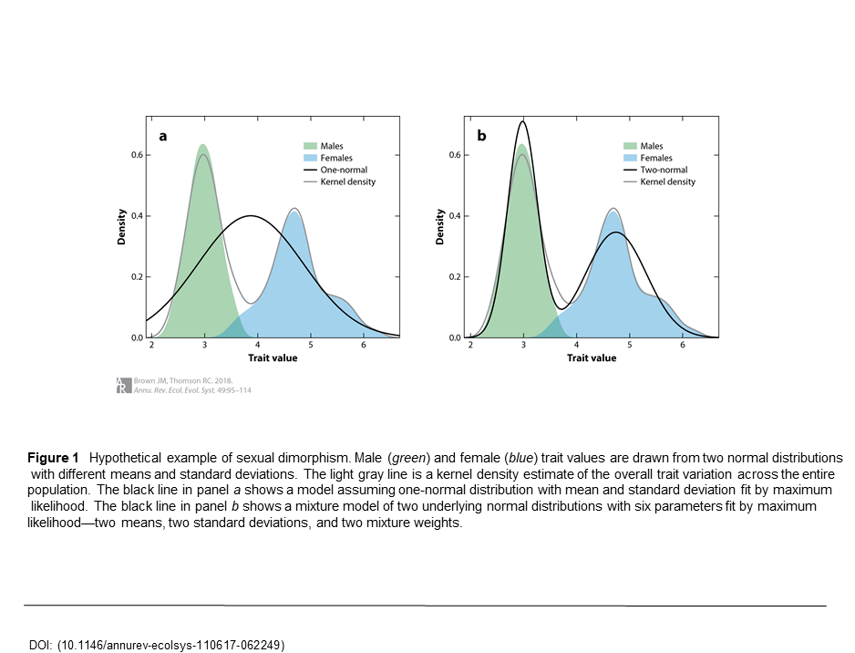
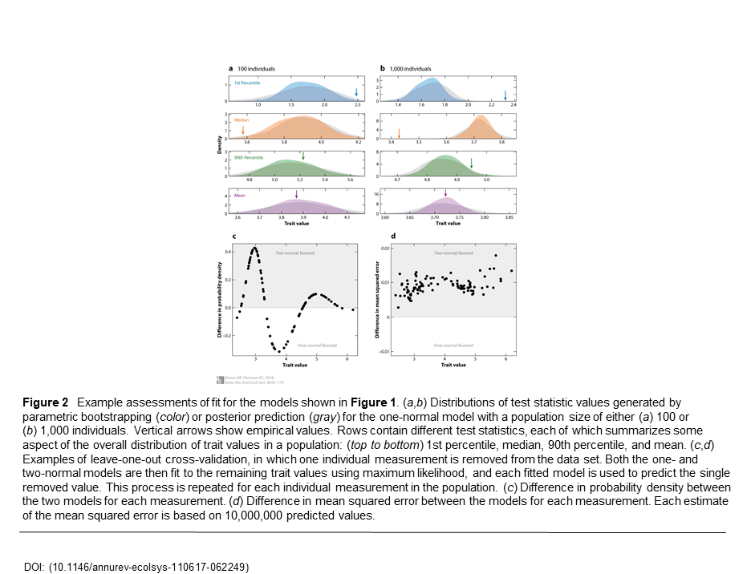



This tutorial introduces the basic principles of the posterior
predictive simulation (P3). P3 works by assessing the fit of an
evolutionary model to a given dataset, by simulating datasets, and analyzing several test
statistics using a traditional goodness-of-fit framework to help explain
where a model may be the most inadequate. 

At the end of this tutorial, you should understand the basic steps to
implement this simulation with their own phylogenetic dataset.  




Fitting an evolutionary model to a dataset is a significant decision for estimating phylogenetic
relationships. A poorly fit model can produce misleading results and lead to inaccurate conclusions. 
Evaluating model fit to a dataset is often overlooked and taken at face value. 
The P3 is a Bayesian evaulation of model fit to a dataset 
, 
that relies on the posterior and the posterior predictive distributions. The posterior 
distribution is the standard output from Bayeisan phylogenetic
inference. The posterior predictive distribution represents a range of
possible outcomes given the assumptions of the model.
The most common method to generate these possible outcomes, is to sample parameters from
the posterior distribution, and use them to simulate new replicate
datasets ().
If these simulated datasets differ from the original
dataset in a meaningful way (will be explained), the model is failing to capture some
salient feature of the evolutionary process, and is not a good fit for the dataset.


 
 
A visual pipeline of PPS starting with your dataset, represented as the shaded sequence matrices. 
1) Running an MCMC analysis on your dataset to produce posterior distributions
2) Based on the posterior distributions of your dataset, multiple datasets are simulated
3) Running an MCMC analysis on the simulated datasets
4) Two options for analyzing the simulated posterior distributions are available: data & inference
 test statistics. This tutorial will only be covering the data test statistic.
-- Results indicating significance and effect size of the original and simulated datasets.



The ability to perform the PPS, create simulated posterior distributions, and
compare them to the original posterior distribution is already built into
RevBayes . This tutorial will go through using PPS
within RevBayes to perform a complete posterior predictive simulation on a provided, example dataset.



The phylogenetic models below are described in a
previous exercise on substitution models (continuous time Markov
models). To specify the model, refer to that previous exercise.
Specifically, you will need to specify the following substitution
models:

-   Jukes-Cantor (JC) substitution model 
-   General-Time-Reversible (GTR) substitution model 
-   Gamma (+G) model for among-site rate variation 
-   Invariable-sites (+I) model 



You will walk through each step of this process to explain 
what is happening in detail. You will be using a sexual dimorphism dataset described below.



The dataset you will be using is  from  describing a
sexually dimorphic trait within males and females of a population .



Panel A: Shows a model assuming one-normal distribution (black line) with mean and standard 
deviation fit by maximum likelihood. 
Panel B: Shows a mixture model of two underlying normal distributions (black line) with six 
parameters fit by maximum likelihood—two means, two standard deviations, and two mixture weights.



The example dataset is found in **data.txt** file. 

For this sexual dimorphism example, our question will be, which model fits the 
data best? The one **normal model in Panel A** or the **mixture model in 
Panel B** .

To begin, we first need a posterior distribution to sample from. We will specify
our dataset (**data.txt**), model, and run a parametric analysis.



This is the step that most researchers do not assess. You now need to 
choose a model to analyze your data with. The question you are trying 
to ask is if the single normal model or the mixture model will fit the 
data best? Therefore, you will choose a single normal and two normal model to asses. 

Single Normal Model
```
for (i in 1:data.size() ){
	d[i] ~ dnNormal(mean,sd)
	d[i].clamp(data[i][1])
}

myModel = model( mean )
```
Two Normal Model - RevBayes is typically not used for non-phylogenetic data. Some work arounds 
are used in this example to accomodate this but will be explained as they occur. This function returns likelihoods. 
You are assuming the sampled sexes have an equal ratio of males to females. 
```
for (i in 1:data.size()){
	m[i] ~ dnMixture(v(mean_1,mean_2),mixture_probs)
	s[i] ~ dnMixture(v(sd_1,sd_2),mixture_probs)
	d[i] ~ dnNormal(m[i],abs(s[i])) # Need to use abs() here to make sure sd is a RealPos
	d[i].clamp(data[i][1])
}

```



(: Step 1)
################################################################################################################
Now you will run an MCMC on the original dataset. For further clarification on MCMC implementations and applications, refer to the _______________________ tutorial.
################################################################################################################

Each section of code is explained above the lines and in the scripts it located in.

Single Normal MCMC
```
# Setting a Uniform(0,10) prior on the mean of our single Normal model
mean ~ dnUnif(0,10)

# Setting a Uniform(0,10) prior on the standard deviation of our single Normal model
sd ~ dnUnif(0,10)

# Initializing vector of moves
moves = VectorMoves()

# Adding slide moves for mean and standard deviation
moves.append( mvSlide(mean, delta=1, weight=1.0) )
moves.append( mvSlide(sd, delta=1, weight=1.0) )

myModel = model( mean )

# Initializing vector of monitors for log file
monitors = VectorMonitors()

# Adding model and screen monitors for log file
monitors.append( mnModel(filename="singleNormal.log",printgen=10,separator="	",stochasticOnly=TRUE) )
monitors.append( mnScreen(printgen=10, mean, sd))

# Set up MCMC object
myMCMC = mcmc(myModel,monitors,moves,nruns=1)

# Run MCMC with chosen number of generations
myMCMC.run(generations=10000)
```
########################################################################################################
Run the **orig_MCMC_SingleNormal.rev** file to perform the MCMC
```
source(orig_MCMC_SingleNormal.rev)
```
######################################################################################### CHECK IF RIGHT
Now we'll run the Two Normal MCMC
RevBayes does not have the capabilities to perform mixture models, so this MCMC is manipulated to accomodate this.
The following code contains the necessary lines of code to perform the MCMC found in **orig_MCMC_TwoNormals.rev**. 
The **orig_MCMC_TwoNormals_fullMCMC.rev** file contains the full script including the extra manipulations necessary for this example.
(These extra code manipulations will not be explained in the tutorial but has short explanations within the code.)
```
# Setting Uniform(0,10) priors on the mean of our two Normal models
mean_1 ~ dnUnif(0,10)
mean_2 ~ dnUnif(0,10)

# Setting Uniform(0,10) priors on the standard deviation of our two Normal models
sd_1 ~ dnUnif(0,10)
sd_2 ~ dnUnif(0,10)

# REMEMBER: You are assuming that you've sampled an equal ratio of males and females.

# Defining equal mixture proportions
mixture_probs ~ dnDirichlet(v(0.5,0.5))
mixture_probs.setValue(v(0.5,0.5))

# Initializing vector of moves
moves = VectorMoves()

# Adding slide moves for mean and standard deviation
moves.append( mvSlide(mean_1, delta=1, weight=1.0) )
moves.append( mvSlide(mean_2, delta=1, weight=1.0) )
moves.append( mvSlide(sd_1, delta=1, weight=1.0) )
moves.append( mvSlide(sd_2, delta=1, weight=1.0) )
for (i in 1:data.size()){
	moves.append( mvMixtureAllocation(m[i], weight=1.0) )
	moves.append( mvMixtureAllocation(s[i], weight=1.0) )
}

myModel = model( mean_1 )

# Initializing vector of monitors
monitors = VectorMonitors()

# Adding model and screen monitors
monitors.append( mnModel(filename="twoNormals.log",printgen=10,separator="	") )
monitors.append( mnFile(m,filename="twoNormals_means.log",printgen=10,separator="	",posterior=FALSE,likelihood=FALSE,prior=FALSE) )
monitors.append( mnFile(s,filename="twoNormals_sds.log",printgen=10,separator="	",posterior=FALSE,likelihood=FALSE,prior=FALSE) )
monitors.append( mnScreen(printgen=10, mean_1, mean_2, sd_1, sd_2))

# Set up MCMC object
myMCMC = mcmc(myModel,monitors,moves,nruns=1)

myMCMC.run(generations=10000)
```
########################################################################################################
Run the **orig_MCMC_TwoNormals_fullMCMC.rev** file to perform the Two Normal MCMC
```
source(orig_MCMC_TwoNormals_fullMCMC.rev)
```
######################################################################################### CHECK IF RIGHT
After the MCMC concludes, you will have new files for each model. 
The Single Normal file produced is **singleNormal_posterior.log**
The Two Normal files produced are **twoNormals_fullMCMC.log, twoNormals_means.log, twoNormals_posterior.log, & twoNormals_sds.log**
These files contain the values you will now use to simulate data from for the P3.



(: Step 2)

Now you will be running the P3 with simulated data based on observed data you just performed the MCMC on. 
The next step of posterior predictive simulation is to simulate new datasets by drawing samples 
and parameters from the posterior distribution generated from the original anlaysis.

This simulation will only be for the **Single Normal Model** from **pps_SingleNormal.rev** file.
```
# Read in model log file from original MCMC
postVals <- readMatrix("singleNormal_posterior.log")

# Read in original data
empDataMatrix <- readMatrix("data.txt")

# Simulate datasets and store in matrix
simCounter = 1
for (gen in 50:postVals.size()){
	sims[simCounter] <- rnorm(n=empData.size(), mean=postVals[gen][5], sd=postVals[gen][6])
	simCounter++
}

# Sort each simulated dataset
for ( s in 1:sims.size() ){
	sims[s] <- sort(sims[s])
}

# Sort empirical dataset
empData <- sort(empData)

# Define generic function to calculate a chosen percentile, p (RevBayes does not have a function to calculate a percentile, so we wrote one)
function percentile(p,nums){
	pos <- round( (p/100) * nums.size() )
	return nums[pos]
}

# Calculate original test statistics of your choice
emp_mean <- mean(empData)
emp_median <- median(empData)
emp_1st <- percentile(1,empData)
emp_90th <- percentile(90,empData)

# Calculate simulated data test statistics (same as original test statistics)
for ( s in 1:sims.size() ){
	sim_means[s] <- mean(sims[s])
	sim_medians[s] <- median(sims[s])
	sim_1sts[s] <- percentile(1,sims[s])
	sim_90ths[s] <- percentile(90,sims[s])
}
# Write a function that evaluates p values
function pVal(e,s){
	lessThan <- 0
	for (i in 1:s.size()){
		if (e > s[i]){
			lessThan++
		}
	}
	return lessThan/s.size()
}

# Calculate posterior predictive p-values (significance value of means, medians, 1st, and 90th percentile)
p_means <- pVal(emp_mean,sim_means)
p_medians <- pVal(emp_median,sim_medians)
p_1sts <- pVal(emp_1st,sim_1sts)
p_90ths <- pVal(emp_90th,sim_90ths)

# Print p-values
print("P-value mean:",p_means)
print("P-value median:",p_medians)
print("P-value 1st percentile:",p_1sts)
print("P-value 90th percentile:",p_90ths)

# Calculate effect sizes for test statistics (Degree of difference between original and simulated datasets of means, medians, 1st, and 90th percentile)
eff_means <- abs(emp_mean-median(sim_means))/stdev(sim_means)
eff_medians <- abs(emp_median-median(sim_medians))/stdev(sim_medians)
eff_1sts <- abs(emp_1st-median(sim_1sts))/stdev(sim_1sts)
eff_90ths <- abs(emp_90th-median(sim_90ths))/stdev(sim_90ths)

# Print effect sizes
print("Effect size mean:",eff_means)
print("Effect size median:",eff_medians)
print("Effect size 1st percentile:",eff_1sts)
print("Effect size 90th percentile:",eff_90ths)
```
The results will look something like this..
```
P-value mean:		0.4774397
P-value median:		0.03147954
P-value 1st percentile:	0.996852
P-value 90th percentile:	0.6883526
Effect size mean:		0.04028857
Effect size median:	1.860162
Effect size 1st percentile:	2.074742
Effect size 90th percentile:	0.4983143
   Processing of file "pps_SingleNormal.rev" completed
```
########################################################################################################
Run the **pps_SingleNormal.rev** file to perform the Single Normal P3
```
source(pps_SingleNormal.rev)
```
######################################################################################### CHECK IF RIGHT


(: Step 2)

This simulation will only be for the **Two Normal Model** from **pps_TwoNormals_fullMCMC.rev** file.
```
paramVals <- readMatrix("twoNormals_fullMCMC.log")

# Read in original data
empDataMatrix <- readMatrix("data.txt")

# Simulate datasets and store in matrix
for (gen in 50:paramVals.size()){
	sims[gen-49] <- rnorm(n=empData.size()/2, mean=paramVals[gen][5], sd=paramVals[gen][7])
	sims[gen-49].append( rnorm(n=empData.size()/2, mean=paramVals[gen][6], sd=paramVals[gen][8]) )
}

# Sort each simulated dataset
for ( s in 1:sims.size() ){
	sims[s] <- sort(sims[s])
}

# Sort original dataset
empData <- sort(empData)

# Define generic function to calculate a chosen percentile, p  (RevBayes does not have a function to calculate a percentile, so we wrote one)
function percentile(p,nums){
	pos <- round( (p/100) * nums.size() )
	return nums[pos]
}

# Calculate original test statistics
emp_mean <- mean(empData)
emp_median <- median(empData)
emp_1st <- percentile(1,empData)
emp_90th <- percentile(90,empData)

# Calculate simulated data test statistics
for ( s in 1:sims.size() ){
	sim_means[s] <- mean(sims[s])
	sim_medians[s] <- median(sims[s])
	sim_1sts[s] <- percentile(1,sims[s])
	sim_90ths[s] <- percentile(90,sims[s])
}

function pVal(e,s){
	lessThan <- 0
	for (i in 1:s.size()){
		if (e > s[i]){
			lessThan++
		}
	}
	return lessThan/s.size()
}

# Calculate posterior predictive p-values
p_means <- pVal(emp_mean,sim_means)
p_medians <- pVal(emp_median,sim_medians)
p_1sts <- pVal(emp_1st,sim_1sts)
p_90ths <- pVal(emp_90th,sim_90ths)

# Print p-values
print("P-value mean:",p_means)
print("P-value median:",p_medians)
print("P-value 1st percentile:",p_1sts)
print("P-value 90th percentile:",p_90ths)

# Calculate effect sizes for test statistics  (Degree of difference between original and simulated datasets of means, medians, 1st, and 90th percentile)
eff_means <- abs(emp_mean-median(sim_means))/stdev(sim_means)
eff_medians <- abs(emp_median-median(sim_medians))/stdev(sim_medians)
eff_1sts <- abs(emp_1st-median(sim_1sts))/stdev(sim_1sts)
eff_90ths <- abs(emp_90th-median(sim_90ths))/stdev(sim_90ths)

# Print effect sizes
print("Effect size mean:",eff_means)
print("Effect size median:",eff_medians)
print("Effect size 1st percentile:",eff_1sts)
print("Effect size 90th percentile:",eff_90ths)
```
Again the results will look something like this..
```
P-value mean:		0.5367647
P-value median:		0.5567227
P-value 1st percentile:	0.6018908
P-value 90th percentile:	0.5178571
Effect size mean:		0.09401804
Effect size median:	0.1331987
Effect size 1st percentile:	0.2221191
Effect size 90th percentile:	0.05351843
   Processing of file "pps_TwoNormals_fullMCMC.rev" completed
```
########################################################################################################
Run the **pps_TwoNormals_fullMCMC.rev** file to perform the Single Normal P3
```
source(pps_TwoNormals_fullMCMC.rev)
```
############################################################################ CHECK IF RIGHT

The simulation process is now complete! You have completed all the steps of the P3. 
We will now go over the test statistic choice, P value and effect size meaning. 
**If you do NOT need this explanation, you can utilize this assessment for your own datasets and do NOT need to continue**
**CONGRATULATIONS!**



(: Step 4)

Now we will explain the test statistics from the original data and
the simulated datasets. 

For more test statistics refer to . In general, this script 
and these statistics work by calculating the statistics of interest across each
posterior distribution from the simulated datasets, and comparing those
values to the values from the original posterior distribution.

You ran four test statistics:

-   1st Percentile
-   Median
-   90th Percentile
-   Mean

There are functions built-in to RevBayes to calculate these values for
you. 
```
mean(dataset)
median(dataset)
```
The percentile function was created for this dataset and is NOT built-into RevBayes
```
function percentile(p,nums){
	pos <- round( (p/100) * nums.size() )
	return nums[pos]
}
```

These same statistics are calculated for both the posterior
distributions from the simulated datasets and the posterior distribution
from the original dataset.



Once you have the test statistics calculated, you can compare the values 
to get a goodness-of-fit. One simple way to do this is to
calculate a posterior predictive *P*-value for each of the test
statistics of interest. The 4 posterior predictive *P*-values currently calculated 
by ‘RevBayes‘ are:

-   Lower 1-tailed
-   Upper 1-tailed
-   2-tailed
-   Midpoint

We wrote a one-tailed *P*-value into the simulation scripts instead of using the built-in options.
```
function pVal(e,s){
	lessThan <- 0
	for (i in 1:s.size()){
		if (e > s[i]){
			lessThan++
		}
	}
	return lessThan/s.size()
}
```

*P*-vlaues are a typical value to base significance from. The P3 values Effect Sizes over *P*-values. That may sound like a 
strange concept but the reasoning behind it is simple. Magnitudes of difference provide more information than the probability 
of the original dataset from the simulated dataset in relation to model fit. 



Another way that you can calculate the magnitude of the discrepancy
between the orignial and simulated datasets is by calculating the effect 
size of each test statistic. Effect sizes are useful in quantifying the
magnitude of the difference between the original value and the
distribution of posterior predictive values. The test statistic effect
size can be calculated by taking the absolute value of the difference
between the median posterior predictive value and the original value
divided by the standard deviation of the posterior predictive
distribution . Effect sizes are calculated automatically
for the inference based test statistics in the P analysis. The effect
sizes for each test statistics are stored in the same output file as the
*P*-values.

Effect sizes used in the example are calculated from the chosen test statistics.
```
eff_means <- abs(emp_mean-median(sim_means))/stdev(sim_means)
eff_medians <- abs(emp_median-median(sim_medians))/stdev(sim_medians)
eff_1sts <- abs(emp_1st-median(sim_1sts))/stdev(sim_1sts)
eff_90ths <- abs(emp_90th-median(sim_90ths))/stdev(sim_90ths)
```
The larger the number, the more different the orignal and simulated 
datasets are.



Let's review the results we produced from the models.
```
P-value mean:		0.4774397
P-value median:		0.03147954
P-value 1st percentile:	0.996852
P-value 90th percentile:	0.6883526
Effect size mean:		0.04028857
Effect size median:	1.860162
Effect size 1st percentile:	2.074742
Effect size 90th percentile:	0.4983143
   Processing of file "pps_SingleNormal.rev" completed

P-value mean:		0.5367647
P-value median:		0.5567227
P-value 1st percentile:	0.6018908
P-value 90th percentile:	0.5178571
Effect size mean:		0.09401804
Effect size median:	0.1331987
Effect size 1st percentile:	0.2221191
Effect size 90th percentile:	0.05351843
   Processing of file "pps_TwoNormals_fullMCMC.rev" completed
```

You can get an estimate of how the model performed by examining the
** *P*-values** and **Effect Sizes**. 

*P*-values are not a great indicator of model fit. *P*-values are subjective to the test stastics that are chosen. 
Effect sizes are produced based on the differences in the test statistics of the original and simulated datasets, 
and are a more powerful indication of fit.

In this example, a quick view shows us that only two of the Single Normal statistics show a *P*-value
around 0.5 and large Effect sizes. This leads to a rejection of the Single Normal model, suggesting that
the model employed is not a good fit for the data. This is the result we
expected given we chose a very simplistic model that would likely
be a poor fit for our sexually dimorphic data. However, it’s a good example of the
sensitivity of this method, showing how relatively short runtimes and a
low number of generations will still detect poor fit. 

You would then fail to reject the Two Normal Model. 
All *P*-values are significant and the Effect sizes are smaller than the Single Normal model. 
**This assessment does not suggest other models, only reject the models you put into it.**


 
 
Posterior prediction results displayed for comparison between differently sized populations; 100 and 1,000.



############################# CITATIONS
